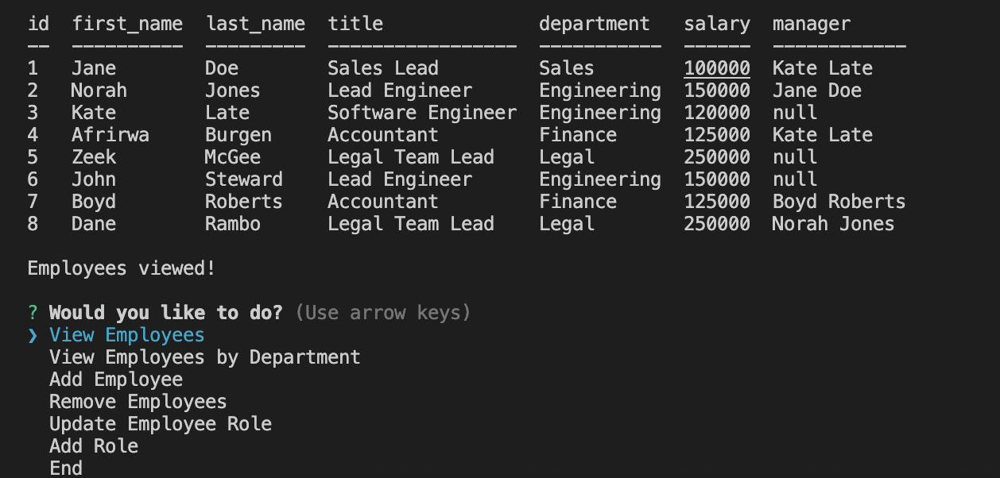

# SQLEmployeeTracker
Command-line application from scratch to manage a company's employee database, using Node.js, Inquirer, and MySQL.

## Description
* Functional application.
* GitHub repository with a unique name and a README describing the project.
* The command-line application should allow users to:
    * Add Departments, Roles, Employees
    * View Departments, Roles, Employees
    * Update Employee Roles

## User Story
```
As a business owner
I want to be able to view and manage the departments, roles, and employees in my company.
```
- [Link to video use of application](https://drive.google.com/file/d/1Rn51DRToBUI3DgCbsF98dnD_fNDQK9VN/view)

### Tech
- Inquirer
- MySQL2
- Console.table
- Javascript
- Node.js
- Dotenv

### Installation
1. Clone from GitHub
2. Open project directory, then npm install to install all required dependencies

### Usage
1. Install npm init -y
2. Npm i inquirer mysql2 console.table dotenv
3. Make sure to SOURCE schema.sql, and seeds.sql files in mySQL command line before running index.js so that tables render correctly.
4. Run "node index.js" or "npm start"
5. Run through prompts/menu as required

### Screenshot


### Contact or questions
[Coleyrockin Github](https://github.com/coleyrockin)

[Coleyrockin@aol.com](mailto:coleyrockin@aol.com)

